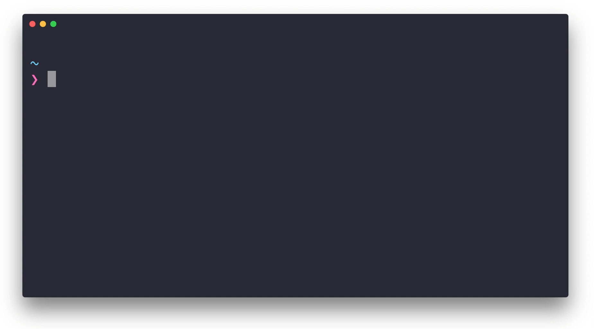

<h1 align="center">
	<br>
	
	<br>
	<br>
	<br>
</h1>

> Fabulously kill processes. Cross-platform.

[](https://travis-ci.org/sindresorhus/fkill-cli)

Works on macOS, Linux, and Windows.


## Install

```
$ npm install --global fkill-cli
```


## Usage

```
$ fkill --help

  Usage
    $ fkill [<pid|name> ...]

  Options
    -f, --force    Force kill
    -v, --verbose  Include arguments in process search 

  Examples
    $ fkill 1337
    $ fkill Safari
    $ fkill 1337 Safari
    $ fkill
    $ fkill -v
```


## Interactive UI

Run `fkill` without arguments to launch the interactive UI.




## Related

- [fkill](https://github.com/sindresorhus/fkill) - API for this module


## License

MIT © [Sindre Sorhus](https://sindresorhus.com)
