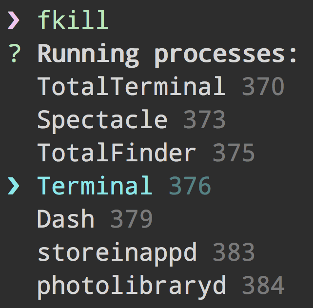

<h1 align="center">
	<br>
	
	<br>
	<br>
	<br>
</h1>

> Force kill processes. Cross-platform.

[](https://travis-ci.org/sindresorhus/fkill-cli)

Works on OS X, Linux, Windows.


## Install

```
$ npm install --global fkill-cli
```


## Usage

```
$ fkill --help

  Usage
    $ fkill [<pid|name> ...]

  Example
    $ fkill 1337
    $ fkill Safari
    $ fkill 1337 Safari
    $ fkill

  Run without arguments to use the interactive interface.
```




## Related

- [fkill](https://github.com/sindresorhus/fkill) - API for this module


## License

MIT © [Sindre Sorhus](http://sindresorhus.com)
